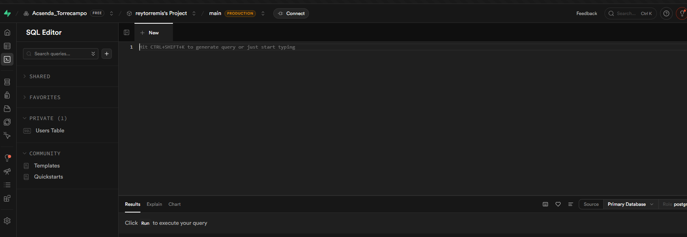
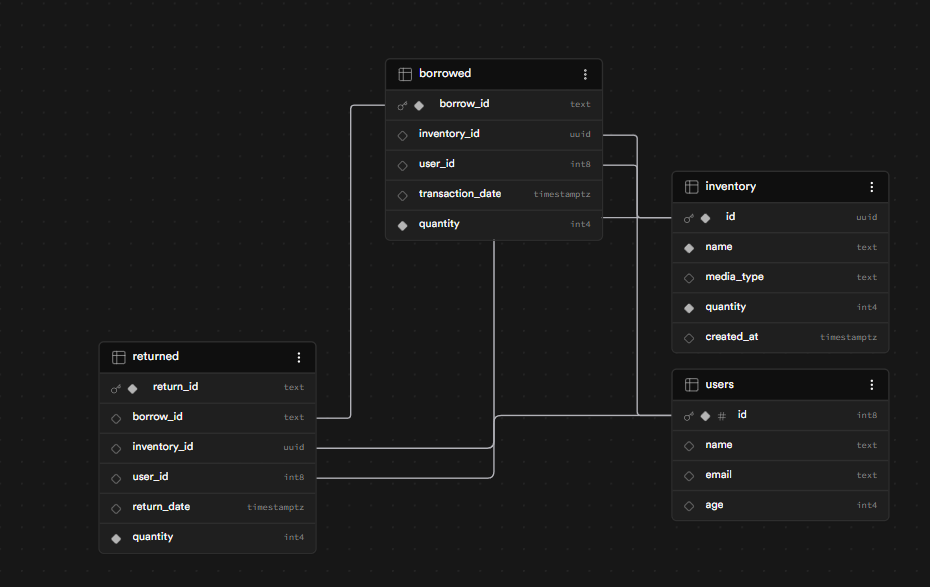
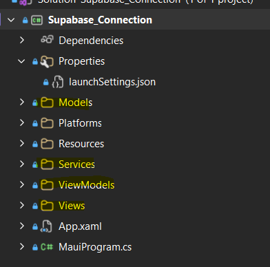

# 📘 Supabase SQL + .NET MAUI Integration Guide  
*A complete reference for the Inventory + Borrow/Return System*

---

## 📑 Table of Contents
- [1. Database Schema](#1-database-schema)
- [2. Stored Procedures](#2-stored-procedures)
- [3. Organizing your files](#3-organizing-your-files)

---

# 1. Database Schema
---

Open Supabase and execute the following SQL scripts in the SQL Editor.



## 1.1 Inventory Table
```sql
create extension if not exists pgcrypto;

create table inventory (
    id uuid primary key default gen_random_uuid(),
    name text,
    quantity int,
    created_at timestamptz default now()
);
```

## 1.2 Borrowed Table
```sql
create table borrowed (
    borrow_id text primary key,
    inventory_id uuid references inventory(id) on delete cascade,
    user_id bigint references users(id) on delete cascade,
    transaction_date timestamptz default now(),
    quantity int not null
);
```

## 1.3 Return Table
```sql
create table returned (
    return_id text primary key,
    borrow_id text references borrowed(borrow_id) on delete cascade,
    inventory_id uuid references inventory(id) on delete cascade,
    user_id bigint references users(id) on delete cascade,
    return_date timestamptz default now(),
    quantity int not null
);
```

All of these are called Table and they will be used to store transactions. After, that we will add a view:
Once you created the tables, your data maodel should look something like this:



## 1.4 Inventory Availability View
```sql
create or replace view inventory_availability as
with borrow_totals as (
    select 
        inventory_id,
        coalesce(sum(quantity), 0) as total_borrowed
    from borrowed
    group by inventory_id
),
return_totals as (
    select 
        inventory_id,
        coalesce(sum(quantity), 0) as total_returned
    from returned
    group by inventory_id
),
latest_activity as (
    select 
        inventory_id,
        greatest(
            coalesce(max(transaction_date), '1900-01-01'),
            coalesce((select max(return_date) from returned r2 where r2.inventory_id = b.inventory_id), '1900-01-01')
        ) as latest_date,
        case 
            when (select max(transaction_date) from borrowed b2 where b2.inventory_id = b.inventory_id) >=
                 (select max(return_date) from returned r2 where r2.inventory_id = b.inventory_id)
            then 'Borrowed'
            else 'Returned'
        end as latest_type
    from borrowed b
    group by inventory_id
)
select 
    i.id as inventory_id,
    i.name as inventory_name,
    i.quantity as max_quantity,
    (i.quantity 
        - coalesce(bt.total_borrowed, 0) 
        + coalesce(rt.total_returned, 0)
    ) as remaining_quantity,
    la.latest_date as latest_transaction_date,
    la.latest_type as latest_transaction_type
from inventory i
left join borrow_totals bt on bt.inventory_id = i.id
left join return_totals rt on rt.inventory_id = i.id
left join latest_activity la on la.inventory_id = i.id;
```

While this query might look too complex, what is does is it gives you the remaining number of inventoey you have. 

---

# 2. Stored Procedures
---

Stored Procedures act like a code in the data base. We use the to communicate with the database and it does the heavy lifting in inserting records.

## 2.1 Safe Borrow Stored Procedure (Prevents Over Borrowing)
```sql
create or replace function safe_insert_borrowed_item(
    p_inventory_id uuid,
    p_user_id bigint,
    p_quantity int
)
returns text
language plpgsql
as $$
declare
    remaining int;
    last_id text;
    new_number int;
    new_id text;
begin
    -- Get remaining quantity from the view
    select remaining_quantity into remaining
    from inventory_availability
    where inventory_id = p_inventory_id;

    if remaining is null then
        raise exception 'Inventory item does not exist.';
    end if;

    if remaining <= 0 then
        raise exception 'No stock available to borrow.';
    end if;

    if p_quantity > remaining then
        raise exception 'Cannot borrow more than remaining quantity (%).', remaining;
    end if;

    -- Generate BUR-00001 ID
    select borrow_id into last_id
    from borrowed
    order by borrow_id desc
    limit 1;

    if last_id is null then
        new_number := 1;
    else
        new_number := (regexp_replace(last_id, '\D', '', 'g'))::int + 1;
    end if;

    new_id := 'BUR-' || lpad(new_number::text, 5, '0');

    insert into borrowed (borrow_id, inventory_id, user_id, quantity)
    values (new_id, p_inventory_id, p_user_id, p_quantity);

    return new_id;
end;

```

## 2.2 Safe Return Stored Procedure (No Over Returning)
```sql
create or replace function safe_insert_returned_item(
    p_borrow_id text,
    p_inventory_id uuid,
    p_user_id bigint,
    p_quantity int
)
returns text
language plpgsql
as $$
declare
    last_id text;
    new_number int;
    new_id text;
    borrowed_qty int;
    returned_qty int;
begin
    -- Get total borrowed for this borrow_id
    select quantity into borrowed_qty
    from borrowed
    where borrow_id = p_borrow_id;

    if borrowed_qty is null then
        raise exception 'Borrow record does not exist.';
    end if;

    -- Get total returned so far
    select coalesce(sum(quantity), 0) into returned_qty
    from returned
    where borrow_id = p_borrow_id;

    if returned_qty + p_quantity > borrowed_qty then
        raise exception 'Cannot return more than borrowed.';
    end if;

    -- Generate RET-00001 ID
    select return_id into last_id
    from returned
    order by return_id desc
    limit 1;

    if last_id is null then
        new_number := 1;
    else
        new_number := (regexp_replace(last_id, '\D', '', 'g'))::int + 1;
    end if;

    new_id := 'RET-' || lpad(new_number::text, 5, '0');

    insert into returned (return_id, borrow_id, inventory_id, user_id, quantity)
    values (new_id, p_borrow_id, p_inventory_id, p_user_id, p_quantity);

    return new_id;
end;
$$;

```

---

# 3. Organizing your files
---


Before we proceed, it’s important to organize your .NET MAUI project into a clean folder structure.  
This keeps your code easy to navigate, easier to maintain, and follows standard MVVM architecture.

Create **four folders** in your project:

1. **Models**  
2. **Services**  
3. **ViewModels**  
4. **Views**

### Why this structure matters

- **Models** contain your data objects — the shapes of the information your app works with.  
- **Services** handle communication with external systems such as Supabase (API calls, SQL functions, etc.).  
- **ViewModels** contain your UI logic, commands, and data binding for each page.  
- **Views** are your XAML pages — the screens the user interacts with.

By separating your code into these folders, you follow the MVVM pattern correctly, avoid clutter, and make your project scalable as it grows.

---
## 3.1 Constants.cs

Just like the previous section, we will create a Constants.cs in the Models folder.

```csharp
public static class Constants
{
    public const string SupabaseUrl = "https://vrqutpxbvpomfhbszcvu.supabase.co";
    public const string SupabaseKey = "sb_publishable_ZkgS1vO8dm62UjvsKsAUpw_BhpbGvg6";
}
```
## Move Files
Move the following files in the View Folder:
1. AppShell.xaml
2. MainPage.xaml

No further action needed.
---

## 🔗 Navigation

[Next →](page2.md)
