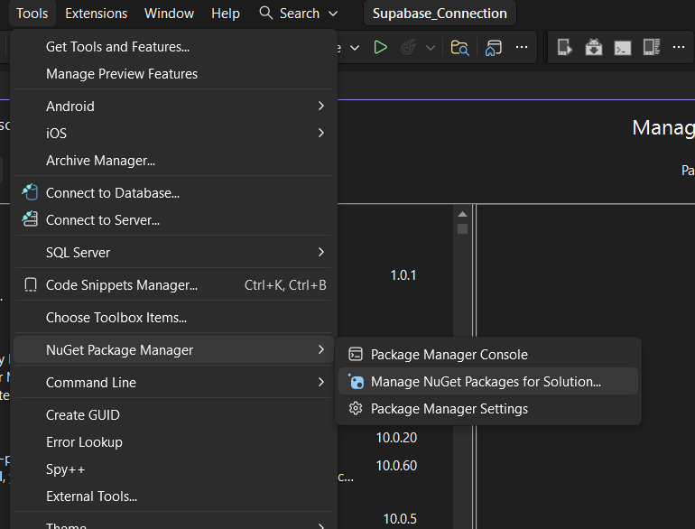
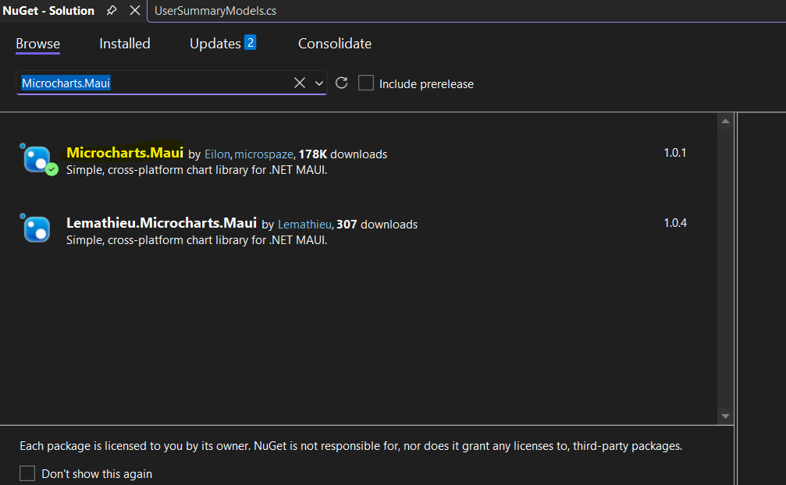
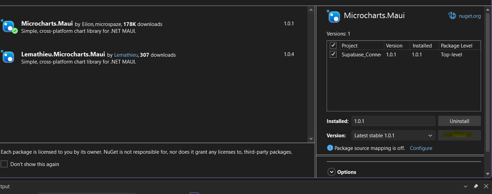

# 📄 Creating Dashboard

In this section, we will create the **Dashboard Page** that will show the summary.

## 📑 Table of Contents
- [1. Set Up](#Set-Up)
- [2. Dashboard Model](#Dashboard-Models)
- [3. Dashboard Services](#Dashboard-Services)
- [4. Dashboard View Models](#Dashboard-ViewModels)
- [5. Dashboard View](#Dashboard-Views)

---
## 📁 Folder Structure Reminder

Your project should now look like this:

```
/Models
/Services
/ViewModels
/Views
```

Place all corresponding files in to the appropriate folders.
---
# Set Up

1. Open Tools > NuGet Package Manager > Manage Nuget Packages for Solution...


2. Click Browse and search for Microcharts.Maui


3. Install Microcharts


4. Open MauiProgram.cs
#### MauiProgram.cs

```csharp
    public static class MauiProgram
    {
        public static MauiApp CreateMauiApp()
        {
            var builder = MauiApp.CreateBuilder();
            builder
                .UseMauiApp<App>()
                .UseMicrocharts() // Add this line
                .ConfigureFonts(fonts =>
                {
                    fonts.AddFont("OpenSans-Regular.ttf", "OpenSansRegular");
                    fonts.AddFont("OpenSans-Semibold.ttf", "OpenSansSemibold");
                })
                ;

#if DEBUG
    		builder.Logging.AddDebug();
#endif

            return builder.Build();
        }
    }
```

5. MainPage.xaml

```xml
<ContentPage xmlns="http://schemas.microsoft.com/dotnet/2021/maui"
             xmlns:x="http://schemas.microsoft.com/winfx/2009/xaml"
             xmlns:microcharts="clr-namespace:Microcharts.Maui;assembly=Microcharts.Maui" // Add This
             x:Class="Supabase_Connection.Views.MainPage"
             Title="Main">
```

6. SQL Statements to be appliedto Supabase
### vw_summary_of_inventory

```sql
create view public.vw_summary_of_inventory as
select
  i.name,
  count(b.borrow_id) + count(r.return_id) as total_transactions
from
  inventory i
  left join borrowed b on i.id = b.inventory_id
  left join returned r on r.inventory_id = i.id
group by
  i.name;
```


### vw_summary_of_transaction

```sql
create view public.vw_summary_of_transaction as
select
  full_name,
  total_borrows - total_returns as rpending_returns,
  total_borrows + total_returns as total_transactions,
  total_borrows,
  total_returns
from
  (
    select
      u.name as full_name,
      count(b.borrow_id) as total_borrows,
      count(r.return_id) as total_returns
    from
      users u
      left join borrowed b on u.id = b.user_id
      left join returned r on u.id = r.user_id
    group by
      u.name
  ) x;
```


# Dashboard Models

## 📁 Models

### UserSummaryModels.cs
```csharp
public class UserSummaryModel
{
    public string full_name { get; set; }
    public int total_borrows { get; set; }
    public int total_returns { get; set; }
    public int pending_returns { get; set; }
    public int total_transactions { get; set; }
}

public class InventorySummaryModel
{
    public string name { get; set; }
    public int total_transactions { get; set; }
}
```


# Dashboard Services

## 📁 Services

### DashboardService.cs
```csharp
public class DashboardService
{
    private readonly HttpClient _client;

    public DashboardService()
    {
        _client = new HttpClient();
        _client.DefaultRequestHeaders.Add("apikey", Constants.SupabaseKey);
        _client.DefaultRequestHeaders.Authorization =
            new System.Net.Http.Headers.AuthenticationHeaderValue("Bearer", Constants.SupabaseKey);
    }

    public async Task<List<UserSummaryModel>> GetUserSummaryAsync()
    {
        var url = $"{Constants.SupabaseUrl}/rest/v1/vw_summary_of_transaction?select=*";
        var json = await _client.GetStringAsync(url);
        return JsonSerializer.Deserialize<List<UserSummaryModel>>(json);
    }

    public async Task<List<InventorySummaryModel>> GetInventorySummaryAsync()
    {
        var url = $"{Constants.SupabaseUrl}/rest/v1/vw_summary_of_inventory?select=*";
        var json = await _client.GetStringAsync(url);
        return JsonSerializer.Deserialize<List<InventorySummaryModel>>(json);
    }
}
```

---

# Dashboard ViewModels

## 📁 ViewModels

## MainPageViewModel.cs
```csharp
public class MainPageViewModel : INotifyPropertyChanged
{
    private readonly DashboardService _service;

    public ObservableCollection<UserSummaryModel> UserSummary { get; set; }
    public ObservableCollection<InventorySummaryModel> InventorySummary { get; set; }

    public Chart UserTransactionsChart { get; set; }
    public Chart InventoryChart { get; set; }

    public MainPageViewModel()
    {
        _service = new DashboardService();

        _ = LoadDashboard();
    }

    public async Task LoadDashboard()
    {
        // Load user summary
        var users = await _service.GetUserSummaryAsync();
        UserSummary = new ObservableCollection<UserSummaryModel>(users);

        // Load inventory summary
        var inventory = await _service.GetInventorySummaryAsync();
        InventorySummary = new ObservableCollection<InventorySummaryModel>(inventory);

        BuildInventoryChart();

        OnPropertyChanged(nameof(UserSummary));
        OnPropertyChanged(nameof(InventorySummary));
        OnPropertyChanged(nameof(UserTransactionsChart));
        OnPropertyChanged(nameof(InventoryChart));
    }

    private void BuildInventoryChart()
    {
        InventoryChart = new BarChart
        {
            Entries = InventorySummary.Select(i =>
                new ChartEntry(i.total_transactions)
                {
                    Label = i.name,
                    ValueLabel = i.total_transactions.ToString(),
                    Color = SKColor.Parse("#2196F3")
                }).ToList(),

            LabelTextSize = 28,                     // readable labels
            LabelOrientation = Orientation.Horizontal,
            ValueLabelOrientation = Orientation.Horizontal,
            BackgroundColor = SKColors.White,
            Margin = 20,
            MaxValue = InventorySummary.Max(i => i.total_transactions)
        };
    }

    public event PropertyChangedEventHandler PropertyChanged;
    private void OnPropertyChanged(string name)
        => PropertyChanged?.Invoke(this, new PropertyChangedEventArgs(name));
}
```
---

# Dashboard Views

## 📁 Views

Replace the Main Page with:

### MainPage

#### MainPage.xaml 

```xml
<ScrollView>
    <VerticalStackLayout Padding="20" Spacing="25">

        <!-- TITLE -->
        <Label Text="Dashboard Summary"
               FontSize="24"
               FontAttributes="Bold"
               HorizontalOptions="Center" />

        <!-- USER SUMMARY TABLE -->
        <VerticalStackLayout>
            <Label Text="User Transaction Summary"
                   FontSize="18"
                   FontAttributes="Bold"
                   Margin="0,10,0,5"/>

            <CollectionView ItemsSource="{Binding UserSummary}">
                <CollectionView.Header>
                    <Grid ColumnDefinitions="2*, *, *, *, *"
                          Padding="8"
                          BackgroundColor="Black">
                        <Label Grid.Column="0" Text="Name" FontAttributes="Bold" />
                        <Label Grid.Column="1" Text="Borrows" FontAttributes="Bold" />
                        <Label Grid.Column="2" Text="Returns" FontAttributes="Bold" />
                        <Label Grid.Column="3" Text="Pending" FontAttributes="Bold" />
                        <Label Grid.Column="4" Text="Total" FontAttributes="Bold" />
                    </Grid>
                </CollectionView.Header>

                <CollectionView.ItemTemplate>
                    <DataTemplate>
                        <Grid ColumnDefinitions="2*, *, *, *, *" Padding="8">
                            <Label Grid.Column="0" Text="{Binding full_name}" />
                            <Label Grid.Column="1" Text="{Binding total_borrows}" />
                            <Label Grid.Column="2" Text="{Binding total_returns}" />
                            <Label Grid.Column="3" Text="{Binding pending_returns}" />
                            <Label Grid.Column="4" Text="{Binding total_transactions}" />
                        </Grid>
                    </DataTemplate>
                </CollectionView.ItemTemplate>
            </CollectionView>
        </VerticalStackLayout>

        <!-- INVENTORY BAR CHART -->
        <VerticalStackLayout>
            <Label Text="Inventory Transaction Summary"
                   FontSize="18"
                   FontAttributes="Bold"
                   Margin="0,10,0,5" />

            <microcharts:ChartView HeightRequest="220"
                                   Chart="{Binding InventoryChart}" />
        </VerticalStackLayout>

    </VerticalStackLayout>
</ScrollView>
```
#### MainPage.xaml.cs

```csharp
public partial class MainPage : ContentPage
{

    private MainPageViewModel _viewModel;

    public MainPage()
    {
        InitializeComponent();
        _viewModel = new MainPageViewModel();
        BindingContext = _viewModel;
    }

    protected override async void OnAppearing()
    {
        base.OnAppearing();

        // Reload dashboard every time page becomes visible
        await _viewModel.LoadDashboard();
    }

}
```

---

## 🔗 Navigation

[← Previous (Transactions)](page3.md) 
